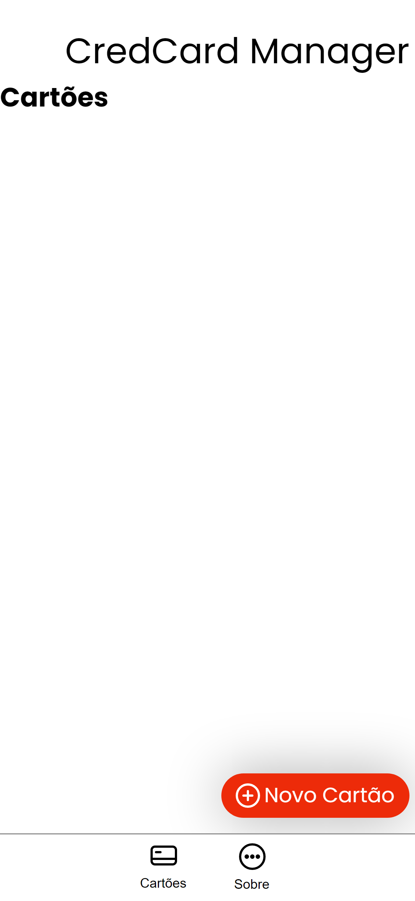
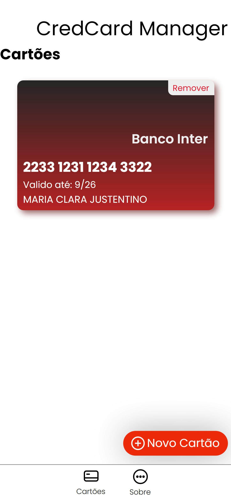

# Gerenciador de cartões fisicos.
  Construido inteiramente em JavaScript e usando estilização pessoal (ModernRound8).
  • 'Credcard Manager v0.75' é de facil uso.

## HTML e CSS para estilização
<h2> Capturas </h2>

  
  

## Futuras adições
<ol>
  <li> Modo escuro e gerência de temas.</li>
  <li> Melhorias na adição das informações.</li>
  <li> Mais informações do cartão como: data de adição e cores personalizadas.</li>
  <li> Melhoria na visualizações no modo 'desktop'.</li>
  <li> Abas de navegação.</li>
</ol>

## OUTROS
Ainda se encontra em estado 'alpha', varios bugs e problemas visuais podem ser encontrados.
Opções como: Salvar os cartões adicionados na memoria do dispositivo ainda não foi implementado, nem as abas de navegação |Cartões e Sobre|
